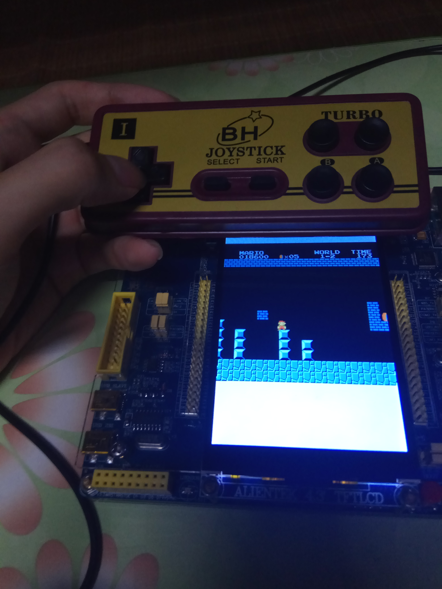
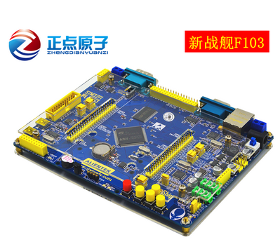
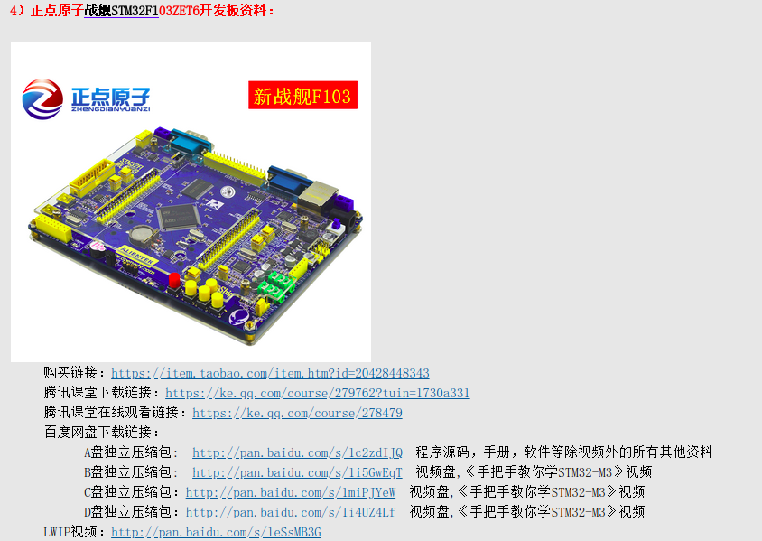

## STM32f103 development with GNU  toolchain

#### Copyright (C) 2018  Frank Curie(邱日)



we transplanted a NES( [Nintendo Entertainment System](https://wiki.nesdev.com/w/index.php/Nesdev)) emulator to our Alientek Worship(v3) stm32f103zet6 development board .This is a Super Mario Bros demo.

### Usage

- git clone https://github.com/Twopothead/stm32f103_NES_Mario
- then cd into "stm32f103_NES_Mario/Mario" directory
- connect Alientek Worship STM32f103 development board to your computer via **J-link** wires, power on.
- "make" then "make jlink",everything will be OK. :)
- Now, you can control Mario with a Joypad.

#### Caveats

- There's only one player.
- It is really slow.:(
- I've only tested  Super Mario Bros, but other most NES games are supported. You can simply replace these games' ROM in stm32f103_NES_Mario/Mario/qiuri_lib/NES_Simulator/ROM__MARIO.c.
- Please confirm your Hardware is OK,especially the fucking **Joypad**!
- There's no sound.This may be an easy work,but I did not have enough time to do so.

------------------

## prerequisites

### STM32f103 development board?

Firstly,you should have an stm32f103 development board. I purchased a Worship STM32f103 development board produced by alientek(**正点原子**) Company.

**正点原子战舰STM32F103ZET6开发板**



- http://www.openedv.com/posts/list/13912.htm

### J-link

For easy program testing and debugging, [**JLInk**](https://www.segger.com/products/debug-probes/j-link/) or **ST-link** is necessary.Here,we purchased a  

SEGGER J-Link from [Taobao](https://item.taobao.com/item.htm?spm=a230r.1.14.8.55117773keobrP&id=561221039328&ns=1&abbucket=20#detail). J-link seems to be more convenient for me. Alternatively, you can use st-link if you like.In that case,I find this website helpful in *how to use st-link*.

- http://www.stmcu.org/module/forum/thread-603768-1-1.html


--------------

## Availability

- Boards(**正点原子战舰STM32F103ZET6开发板**) available at  [Alientek](http://www.openedv.com/posts/list/13912.htm)
- **J-link** available at  [Taobao](https://item.taobao.com/item.htm?spm=a230r.1.14.8.55117773keobrP&id=561221039328&ns=1&abbucket=20#detail)

-----------


### STM32 Firmware library

We should use **suitable** firmware library provided by STM32F103 development board's manufactures.If you use **WRONG** library, it will **NOT WORK**!

Alientek company post Worship(V3) STM32f103zet6 development board related materials here:

http://www.openedv.com/posts/list/13912.htm

source code and other files can be downloaded here(**Recommanded**) : https://pan.baidu.com/s/1c2zdIJQ



Here is a github version:https://github.com/898311543/worship_stm32 

We should use its firmware library.

--------------------------------------------------

# GNU Toolchain for ARM 

GCC for ARM and J-link related software provided by segger Company is necessary.

- install arm-gcc
```sh
# gcc-arm-none-eabi (without an OS)
sudo apt-get install gcc-arm-none-eabi
# apt search "gcc-5-arm"
# gcc-5-arm-linux-gnueabi/bionic,bionic 5.5.0-10ubuntu1cross1 amd64 GNU C compiler
sudo apt-get install  gcc-5-arm-linux-gnueabihf
sudo apt-get install  gcc-arm-linux-gnueabihf
```
- install J-Link for Linux

    - [J-Link Software and Documentation pack for Linux, DEB installer, 64-bit](https://www.segger.com/downloads/jlink#J-LinkSoftwareAndDocumentationPack)
```shell
# https://www.segger.com/downloads/jlink/JLink_Linux_x86_64.deb
sudo chmod 777 JLink_Linux_V630k_x86_64.deb
sudo dpkg -i JLink_Linux_V630k_x86_64.deb 
# /opt/SEGGER/JLink /opt/SEGGER/JLink_V630k
# J-Link has a dependency on libusb
sudo apt-get install libusb-dev
sudo apt-get install libusb-1.0-0-dev
```
### Template Project 

**"LED blink"** (最简单的跑马灯) is the **"Hello world!"** for STM32 development. Comparatively speaking, it the simplest project, but also the hardest for beginners. Find a suitable template STM32F103 board project developed with GNU toolchain  and adapt it to our Alientek Worship(V3) STM32F103 board (using firmware library provide by Alintek board manufacture) is not so easy for me, but thanks to friends' help, I finally made it."Hello world!" Code for Alientek Worship(v3)  stm32f103zet6 development board can be downloaded here.  

- https://github.com/Twopothead/stm32f103_blink

You can use it as a template under Ubuntu if you like. :)

Furthermore, we transplant a NES emulator to our Alientek Worship stm32f103zet6 development board ,(

NES is short for [Nintendo Entertainment System](https://wiki.nesdev.com/w/index.php/Nesdev))using Super Mario Bros as a demo.You can control Mario with a joypad.

- https://github.com/Twopothead/stm32f103_NES_Mario


--------

 Thanks to Chaos Chen(陈尧). We transplant NES emulator to our Worship stm32f103 development Board in free time. Lots of code taken from github. we just fix some fucking bugs and adapt NES emulator to our boards. Thank tons .Everything that isn't mine is distributed under their respective licenses. This project is distributed under GNU Lesser General Public License v2.1.Feel free to use it.

Last but not least,**Just have fun!**

---------


### References 

- https://github.com/Twopothead/stm32f103_blink
- https://github.com/xwensoft/vscode_template_stm32f103
- https://github.com/steward-fu/handheld/tree/master/nes4stm32
- http://www.stmcu.org/module/forum/thread-603753-1-1.html (end.zip)
- https://www.zhihu.com/people/wierton/answers?page=2
- https://wiki.nesdev.com/w/index.php/Nesdev